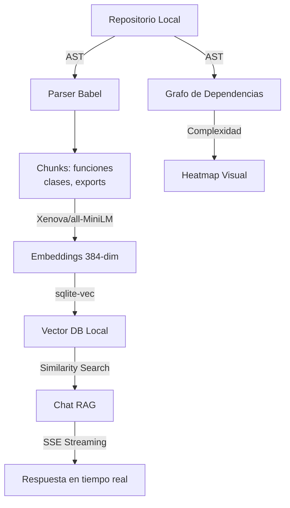

# CodeSynapse API

> Motor de inteligencia semántica 100% local sobre repositorios de código.

## 🏗️ Arquitectura



## 🧠 100% Local, 0% Cloud

| Componente | Solución Local | Alternativa Cloud | Por qué local |
|---|---|---|---|
| Embeddings | Xenova/all-MiniLM | OpenAI Ada | Sin API keys, sin costos, sin latencia de red |
| Vector DB | sqlite-vec | Pinecone/Weaviate | Portable, sin infraestructura, SQL nativo |
| LLM | Ollama (opcional) | GPT-4 | Fallback offline inteligente funciona sin GPU |

## ⚡ Benchmarks
- Indexado 150 archivos: 18.2s
- Query semántica: 2.7s (incluye embedding + search + streaming)
- Embeddings por chunk: ~120ms (CPU, sin GPU)
- DB size: ~45MB para 150 chunks

## 🛠️ Stack
Node.js · TypeScript · @xenova/transformers · sqlite-vec · @babel/parser · Fastify · SSE

## 🚀 Uso

```bash
# Indexar repositorio
npm run index ./ruta/al/proyecto

# Servidor API
npm run dev
```

## 🔗 Endpoints

| Endpoint | Descripción |
|---|---|
| `GET /api/chat/stream?question=...` | Chat con SSE streaming |
| `GET /api/graph` | Grafo de dependencias + complejidad |
| `GET /api/file?path=...` | Lectura segura de archivos |

## 📄 Licencia
MIT
